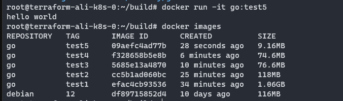

## 制作提交尽可能小的镜像

```go
package main

import "fmt"

func main() {
    fmt.Println("hello world")
}
```

### 使用golang:1.19作为基础镜像
```dockerfile
# Dockerfile-1
FROM golang:1.19
WORKDIR /app/src
COPY . ./
RUN GO111MODULE=off go build -o app
CMD ["./app"]
```
#### docker build
- 运行`docker build -t go:test1 -f Dockerfile-1 .`开始构建
- 构建完成通过`docker images`可以看到`go:test1`镜像
- 这里的镜像体积有1.06GB


### 使用两阶段构建
#### debian
```dockerfile
# Dockerfile-2
# Build stage
FROM golang:1.19 AS builder
WORKDIR /app/src
COPY . ./
RUN GO111MODULE=off go build -o app
# Final Stage
FROM debian:12   
WORKDIR /app/src
COPY --from=builder /app/src/app .
CMD ["./app"]
```
- 这次镜像提交减少到了118MB，这里可以看出镜像大小主要取决于运行阶段基础镜像体积

- 那么采用镜像体积更小的基础镜像就可以进一步优化了

#### debian:12-slim
```dockerfile
# Dockerfile-3
# Build stage
FROM golang:1.19 AS builder
WORKDIR /app/src
COPY . ./
RUN GO111MODULE=off go build -o app
# Final Stage
FROM debian:12-slim
WORKDIR /app/src
COPY --from=builder /app/src/app .
CMD ["./app"]
```

镜像体积减少到76M了

#### ubuntu:20.04
- 还可以尝试使用Ubuntu镜像
```dockerfile
# Dockerfile-4
# Build stage
FROM golang:1.19 AS builder
WORKDIR /app/src
COPY . ./
RUN GO111MODULE=off go build -o app
# Final Stage
FROM ubuntu:20.04
WORKDIR /app/src
COPY --from=builder /app/src/app .
CMD ["./app"]
```


#### alpine
```dockerfile
# Dockerfile-5
# Build stage
FROM golang:1.19 AS builder
WORKDIR /app/src
COPY . ./
RUN GO111MODULE=off go build -o app
# Final Stage
FROM alpine:3.18  
WORKDIR /app/src
COPY --from=builder /app/src/app .
CMD ["./app"]
```

基于alpine镜像的最终镜像体积只有9MB

### alpine的问题
> 上面的镜像可以成功运行，打印出了预期的结果，看起来似乎没什么问题但是在实际工作中alpine镜像很容易出现问题
#### 尝试网络调用
```go
package main

import (
    "fmt"
    "net"
)

func handleClient(conn net.Conn) {
    defer conn.Close() // 确保在函数退出时关闭连接

    buffer := make([]byte, 1024)
    for {
        // 从客户端读取数据
        n, err := conn.Read(buffer)
        if err != nil {
            fmt.Println("Error reading:", err)
            return
        }

        // 回显客户端发送的数据
        _, err = conn.Write(buffer[:n])
        if err != nil {
            fmt.Println("Error writing:", err)
            return
        }
    }
}

func main() {
    // 创建 TCP 服务器监听地址和端口
    listener, err := net.Listen("tcp", "127.0.0.1:8080")
    if err != nil {
        fmt.Println("Error listening:", err)
        return
    }
    defer listener.Close() // 确保在程序退出时关闭监听

    fmt.Println("Server is listening on 127.0.0.1:8080")

    for {
        // 等待客户端连接
        conn, err := listener.Accept()
        if err != nil {
            fmt.Println("Error accepting connection:", err)
            continue
        }

        // 启动一个新的 goroutine 处理客户端连接
        go handleClient(conn)
    }
}
```
再使用alpine镜像构建
```dockerfile
# Dockerfile-6
# Build stage
FROM golang:1.19 AS builder
WORKDIR /app/src
COPY . ./
RUN GO111MODULE=off go build -o app
# Final Stage
FROM alpine:3.18  
WORKDIR /app/src
COPY --from=builder /app/src/app .
CMD ["./app"]
```
镜像可以成功构建却无法运行


#### 采用静态编译
可以通过对netgo采用静态编译的方式来避免问题
```dockerfile
# Dockerfile-7
# Build stage
FROM golang:1.19 AS builder
WORKDIR /app/src
COPY . ./
RUN GO111MODULE=off go build -tags netgo -ldflags '-extldflags "static"' -o app
# Final Stage
FROM alpine:3.18
WORKDIR /app/src
COPY --from=builder /app/src/app .
CMD ["./app"]
```


#### 禁用CGO
- 实际环境可能更复杂，如果不知道使用了哪些C模块，就无法通过设置-tags，来指定模块的编译选项
- 通过设置环境变量`CGO_ENABLED`，可以禁止cgo的使用，也能解决了上述的问题。
```dockerfile
# Dockerfile-8
# Build stage
FROM golang:1.19 AS builder
WORKDIR /app/src
COPY . ./
RUN GO111MODULE=off CGO_ENABLED=0 go build -o app
# Final Stage
FROM alpine:3.18
WORKDIR /app/src
COPY --from=builder /app/src/app .
CMD ["./app"]
```


#### 使用golang:1.19-alpine3.18进行构建
```dockerfile
# Dockerfile-9
# Build stage
FROM golang:1.19-alpine3.18 AS builder
WORKDIR /app/src
COPY . ./
RUN GO111MODULE=off go build -o app
# Final Stage
FROM alpine:3.18
WORKDIR /app/src
COPY --from=builder /app/src/app .
CMD ["./app"]
```


#### 总结
- 因为没有glibc库而是使用更轻量级的musl libc库，无法运行动态链接的二进制文件，alpine镜像在支持CGO（C语言调用Go）时往往会出问题
- 通常解决方法有：
    1. 采用静态编译
    2. 禁用CGO
    3. 或者在编译阶段使用`golang:1.19-alpine3.18`来构建(如果一定要使用alpine镜像，推荐这种)
- **为确保服务稳定，正式环境应避免使用alpine镜像**

### scratch
- `scratch`是一个空白的镜像
- 可以理解成一个虚拟的文件系统，里面什么都没有
```dockerfile
# Dockerfile-10
# Build stage
FROM golang:1.19 AS builder
WORKDIR /app/src
COPY . ./
RUN GO111MODULE=off CGO_ENABLED=0 go build -o app
# Final Stage
FROM scratch
WORKDIR /app/src
COPY --from=builder /app/src/app .
CMD ["/app/src/app"]
```

使用scratch镜像最终镜像大小只有2.9M，不过scratch没有内置任何sh，因此不方便程序调试