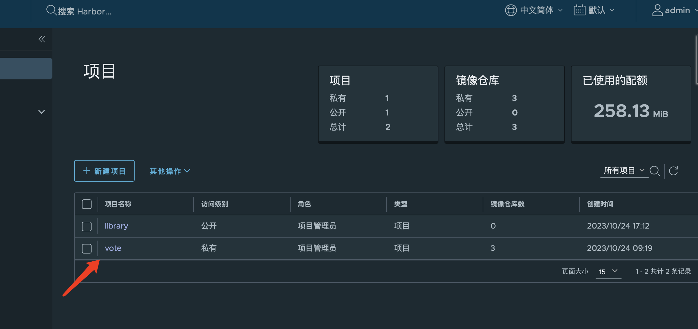
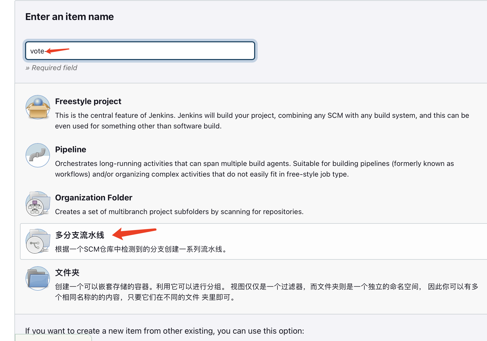
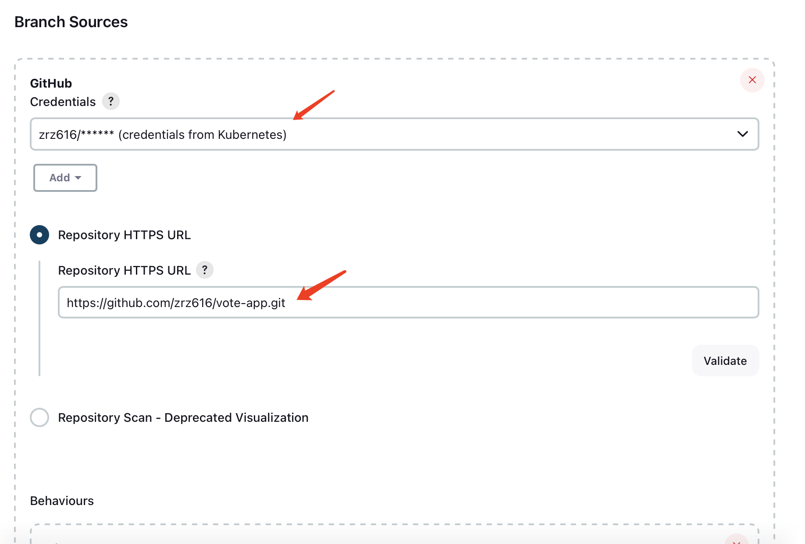
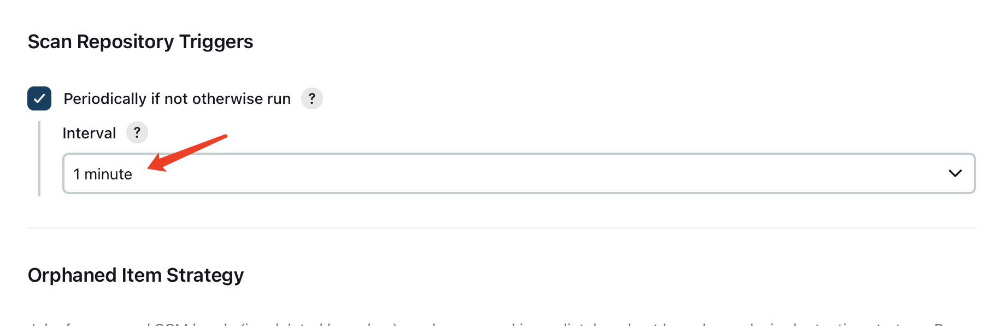
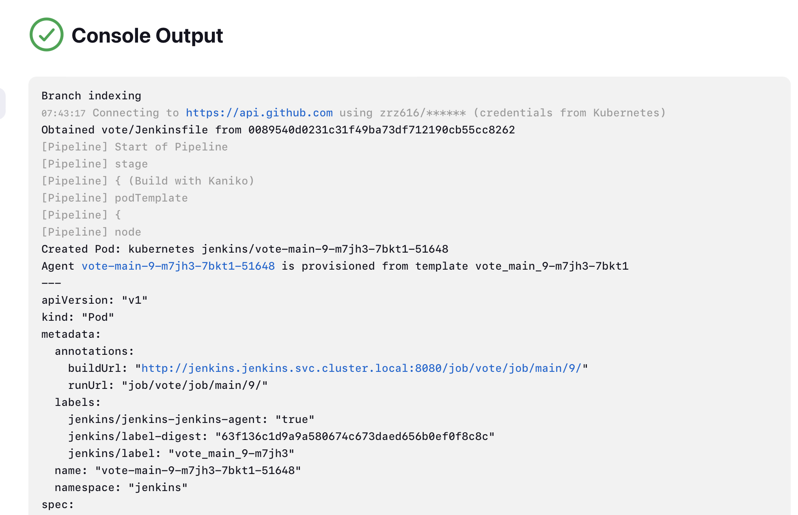
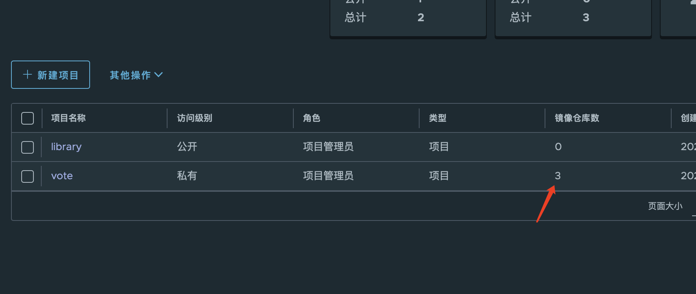
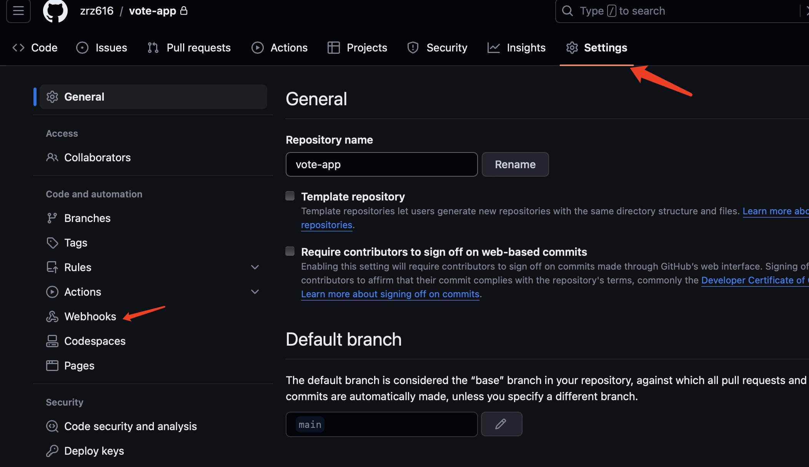
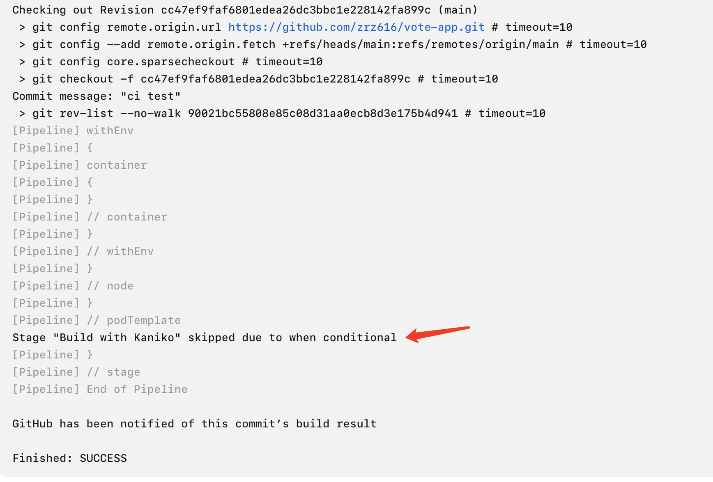
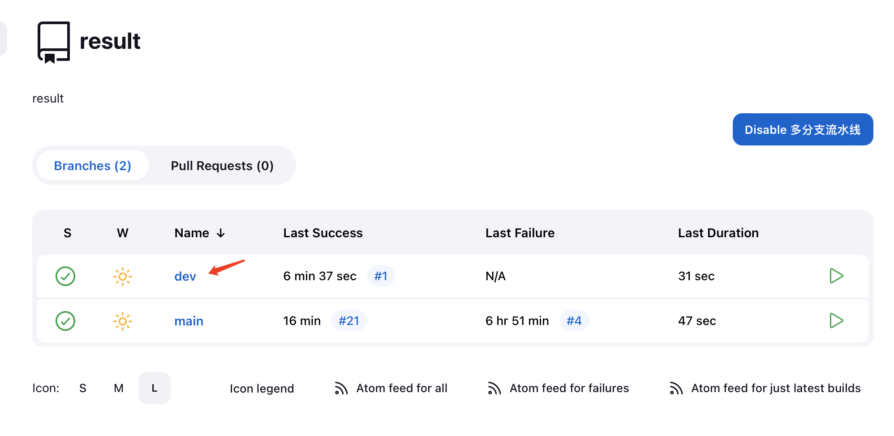

# 持续集成(CI)
本次实验使用github+harbor+jenkins的方式

## 环境准备
1. 提前在github建立一个vote-app仓库, 仓库中每个目录代表一个微服务
2. 并搭建好harbor和jenkins

### harbor
使用terraform创建高可用harbor节点, 使用aliyun oss作为镜像存储，redis和postgresql使用aliyun托管版本

下面是harbor的配置：
``` yaml
# harbor-values.yaml
persistence:
  imageChartStorage:
    type: oss
    oss:
      region: cn-hongkong
      # bucket: ${bucket}
      # accesskeyid: ${secret_id}
      # accesskeysecret: ${secret_key}
      # endpoint: ${endpoint}

expose:
  ingress:
    annotations:
      kubernetes.io/tls-acme: "true"
      cert-manager.io/issuer: "harbor-issuer"

portal:
  replicas: 2

core:
  replicas: 2

jobservice:
  replicas: 2

registry:
  replicas: 2

chartmuseum:
  replicas: 2
```

然后使用terraform helm模块安装：
``` hcl
module "helm" {
  source   = "../../module/helm"
  filename = local_sensitive_file.kubeconfig.filename
  helm_charts = [
    {
      name             = "harbor"
      namespace        = "harbor"
      repository       = "https://helm.goharbor.io"
      chart            = "harbor"
      version          = "1.13.0"
      create_namespace = true
      values_file      = "${path.module}/yaml/harbor-values.yaml"
      set = [
        {
          "name" : "persistence.imageChartStorage.oss.bucket",
          "value" : "${module.oos.app_id}",
        },
        {
          "name" : "persistence.imageChartStorage.oss.accesskeyid",
          "value" : "${var.access_key}",
        },
        {
          "name" : "persistence.imageChartStorage.oss.accesskeysecret",
          "value" : "${var.secret_key}",
        },
        {
          "name" : "persistence.imageChartStorage.oss.endpoint",
          "value" : "${module.oos.endpoint}",
        },
        {
          "name" : "expose.ingress.hosts.core",
          "value" : "harbor.${var.prefix}.${var.domain}",
        },
        {
          "name" : "expose.ingress.hosts.notary",
          "value" : "notary.${var.prefix}.${var.domain}",
        },
        {
          "name" : "expose.ingress.className",
          "value" : "nginx",
        },
        {
          "name" : "expose.tls.enabled",
          "value" : "true",
        },
        {
          "name" : "expose.tls.certSource",
          "value" : "secret",
        },
        {
          "name" : "expose.tls.secret.secretName",
          "value" : "harbor-secret-tls",
        },
        {
          "name" : "expose.tls.secret.notarySecretName",
          "value" : "notary-secret-tls",
        },
        {
          "name" : "externalURL",
          "value" : "https://harbor.${var.prefix}.${var.domain}"
        },
        {
          "name" : "database.type",
          "value" : "external"
        },
        {
          "name" : "database.external.host",
          "value" : module.postgresql.private_access_ip
        },
        {
          "name" : "database.external.username",
          "value" : "${var.db_account_name}"
        },
        {
          "name" : "database.external.password",
          "value" : "${var.db_account_password}"
        },
        {
          "name" : "redis.type",
          "value" : "external"
        },
        {
		  # 这里redis使用vpc_no_auth模式
          "name" : "redis.external.addr",
          "value" : module.redis.private_ip
        }
      ]
    }
  ]
}
```

```shell
terraform apply -auto-approve
```

搭建好harbor后登录dashborad创建一个vote项目用于存放后续实验镜像


### jenkins
jenkins同样使用helm Chart的方式安装
``` yaml
# jenkins-values.yaml
agent:
  resources:
    requests:
      cpu: "512m"
      memory: "512Mi"
    limits:
      cpu: "2000m"
      memory: "2048Mi"
controller:
  containerEnv:
    - name: HARBOR_URL
      value: "harbor.${prefix}.${domain}"
  ingress:
    enabled: true
    hostName: jenkins.${prefix}.${domain}
    ingressClassName: nginx
  adminPassword: "password123"
  installPlugins:
    - kubernetes:4029.v5712230ccb_f8
    - workflow-aggregator:596.v8c21c963d92d
    - git:5.1.0
    - configuration-as-code:1670.v564dc8b_982d0
  additionalPlugins:
    - prometheus:2.2.3
    - kubernetes-credentials-provider:1.211.vc236a_f5a_2f3c
    - job-dsl:1.84
    - github:1.37.1
    - github-branch-source:1725.vd391eef681a_e
    - gitlab-branch-source:660.vd45c0f4c0042
    - gitlab-kubernetes-credentials:132.v23fd732822dc
    - pipeline-stage-view:2.33
    - sonar:2.15
    - pipeline-utility-steps:2.16.0
```
这里helm Chart会安装好本次实验所需的jenkins插件

还需要给jenkins创建一个从harbor拉取镜像的凭证
``` shell
# harbor image pull secret
kubectl create secret docker-registry regcred --docker-server=harbor.${prefix}.${domain} --docker-username=admin --docker-password=${harbor_password} -n jenkins
```

## 多目录多分支流水线构建
1. 可以从在jenkins dashboard上创建，vote、result、worker三个item


2. 设置代码仓库地址和拉取凭证


3. 设置主动扫描策略


4. 配置pipeline script
添加Jenkinsfile文件到代码仓库的每个目录下，配置示例如下：
``` groovy
pipeline {
  agent none
  stages {
    stage('Build with Kaniko') {
      agent {
        kubernetes {
          defaultContainer 'kaniko'
          yaml '''
  apiVersion: v1
  kind: Pod
  spec:
    containers:
    - name: kaniko
      image: gcr.io/kaniko-project/executor:v1.11.0-debug
      imagePullPolicy: Always
      command:
      - sleep
      args:
      - 99d
      tty: true
      volumeMounts:
      - name: jenkins-docker-cfg
        mountPath: /kaniko/.docker
    volumes:
    - name: jenkins-docker-cfg
      projected:
        sources:
        - secret:
            name: regcred
            items:
            - key: .dockerconfigjson
              path: config.json
  '''
        }
      }

      environment {
        HARBOR_URL = credentials('harbor-url')
        IMAGE_PUSH_DESTINATION = "${HARBOR_URL}/vote/vote"
        GIT_COMMIT = "${checkout (scm).GIT_COMMIT}"
        IMAGE_TAG = "${BRANCH_NAME}-${GIT_COMMIT}"
        BUILD_IMAGE = "${IMAGE_PUSH_DESTINATION}:${IMAGE_TAG}"
        BUILD_IMAGE_LATEST = "${IMAGE_PUSH_DESTINATION}:latest"
      }

      steps {
        container(name: 'kaniko', shell: '/busybox/sh') {
          withEnv(['PATH+EXTRA=/busybox']) {
            sh '''#!/busybox/sh
              cd vote
              /kaniko/executor --context=`pwd` --destination=${BUILD_IMAGE} --insecure
            '''
          }
        }
      }
    }
  }
}
```
再将代码更新上传，等待jenkins扫描后，开始构建流水线


> 需要注意jenkins每次拉取jenkinsfile都是从当前分支最新的commit拉取，确保jenkinsfile有错误时，在修改后还可以正常重新构建

构建完成后harbor上可以看到vote项目里出现3个镜像仓库，并且各有一个镜像制品


### webhook主动推送
- 在github项目里设置webhook，并填上harbor的webhook url：
	http://jenkins.blkuo301.devopscamp.us/github-webhook/
- 然后点击测试按钮，如果能收到回调信息则表示配置正确。
- 这样只要你push了代码，就会触发pipeline


## 按需构建
目前已经可以实现大仓下分目录构建，但是每次提交更新都会触发三条流水线

### 改进
可以通过设置构建条件来避免多余动作
``` groovy
pipeline {
  agent none
  stages {
    stage('Build with Kaniko') {
      when {
        changeset "result/**"
      }
      agent {
        kubernetes {
          defaultContainer 'kaniko'
          yaml '''
  apiVersion: v1
  kind: Pod
  spec:
    containers:
    - name: kaniko
      image: gcr.io/kaniko-project/executor:v1.11.0-debug
      imagePullPolicy: Always
      command:
      - sleep
      args:
      - 99d
      tty: true
      volumeMounts:
      - name: jenkins-docker-cfg
        mountPath: /kaniko/.docker
    volumes:
    - name: jenkins-docker-cfg
      projected:
        sources:
        - secret:
            name: regcred
            items:
            - key: .dockerconfigjson
              path: config.json
  '''
        }
      }

      environment {
        HARBOR_URL = credentials('harbor-url')
        IMAGE_PUSH_DESTINATION = "${HARBOR_URL}/vote/result"
        GIT_COMMIT = "${checkout (scm).GIT_COMMIT}"
        IMAGE_TAG = "${BRANCH_NAME}-${GIT_COMMIT}"
        BUILD_IMAGE = "${IMAGE_PUSH_DESTINATION}:${IMAGE_TAG}"
        BUILD_IMAGE_LATEST = "${IMAGE_PUSH_DESTINATION}:latest"
      }

      steps {
        container(name: 'kaniko', shell: '/busybox/sh') {
          withEnv(['PATH+EXTRA=/busybox']) {
            sh '''#!/busybox/sh
              cd result
              /kaniko/executor --context=`pwd` --destination=${BUILD_IMAGE} --insecure
            '''
          }
        }
      }
    }
  }
}
```
通过设置changeset确保只有被更新的目录会触发流水线


## 单一pipline
以上方法虽然可以解决按需构建，但是每次都会造成流水线空跑，可以将流水线合并为一条来避免

建立单个名为vote-app的item，jenkinsfile的路径设置为项目根目录
``` groovy
pipeline {
  agent none
  stages {
    stage('Build result') {
      when {
        changeset "result/**"
      }
      agent {
        kubernetes {
          defaultContainer 'kaniko'
          yaml '''
  apiVersion: v1
  kind: Pod
  spec:
    containers:
    - name: kaniko
      image: gcr.io/kaniko-project/executor:v1.11.0-debug
      imagePullPolicy: Always
      command:
      - sleep
      args:
      - 99d
      tty: true
      volumeMounts:
      - name: jenkins-docker-cfg
        mountPath: /kaniko/.docker
    volumes:
    - name: jenkins-docker-cfg
      projected:
        sources:
        - secret:
            name: regcred
            items:
            - key: .dockerconfigjson
              path: config.json
  '''
        }
      }

      environment {
        HARBOR_URL = credentials('harbor-url')
        IMAGE_PUSH_DESTINATION = "${HARBOR_URL}/vote/result"
        GIT_COMMIT = "${checkout (scm).GIT_COMMIT}"
        IMAGE_TAG = "${BRANCH_NAME}-${GIT_COMMIT}"
        BUILD_IMAGE = "${IMAGE_PUSH_DESTINATION}:${IMAGE_TAG}"
        BUILD_IMAGE_LATEST = "${IMAGE_PUSH_DESTINATION}:latest"
      }

      steps {
        container(name: 'kaniko', shell: '/busybox/sh') {
          withEnv(['PATH+EXTRA=/busybox']) {
            sh '''#!/busybox/sh
              cd result
              /kaniko/executor --context=`pwd` --destination=${BUILD_IMAGE} --insecure
            '''
          }
        }
      }
    }

    stage('Build vote') {
      when {
        changeset "vote/**"
      }
      agent {
        kubernetes {
          defaultContainer 'kaniko'
          yaml '''
  apiVersion: v1
  kind: Pod
  spec:
    containers:
    - name: kaniko
      image: gcr.io/kaniko-project/executor:v1.11.0-debug
      imagePullPolicy: Always
      command:
      - sleep
      args:
      - 99d
      tty: true
      volumeMounts:
      - name: jenkins-docker-cfg
        mountPath: /kaniko/.docker
    volumes:
    - name: jenkins-docker-cfg
      projected:
        sources:
        - secret:
            name: regcred
            items:
            - key: .dockerconfigjson
              path: config.json
  '''
        }
      }

      environment {
        HARBOR_URL = credentials('harbor-url')
        IMAGE_PUSH_DESTINATION = "${HARBOR_URL}/vote/vote"
        GIT_COMMIT = "${checkout (scm).GIT_COMMIT}"
        IMAGE_TAG = "${BRANCH_NAME}-${GIT_COMMIT}"
        BUILD_IMAGE = "${IMAGE_PUSH_DESTINATION}:${IMAGE_TAG}"
        BUILD_IMAGE_LATEST = "${IMAGE_PUSH_DESTINATION}:latest"
      }

      steps {
        container(name: 'kaniko', shell: '/busybox/sh') {
          withEnv(['PATH+EXTRA=/busybox']) {
            sh '''#!/busybox/sh
              cd vote
              /kaniko/executor --context=`pwd` --destination=${BUILD_IMAGE} --insecure
            '''
          }
        }
      }
    }

    stage('Build worker') {
      when {
        changeset "worker/**"
      }
      agent {
        kubernetes {
          defaultContainer 'kaniko'
          yaml '''
  apiVersion: v1
  kind: Pod
  spec:
    containers:
    - name: kaniko
      image: gcr.io/kaniko-project/executor:v1.11.0-debug
      imagePullPolicy: Always
      command:
      - sleep
      args:
      - 99d
      tty: true
      volumeMounts:
      - name: jenkins-docker-cfg
        mountPath: /kaniko/.docker
    volumes:
    - name: jenkins-docker-cfg
      projected:
        sources:
        - secret:
            name: regcred
            items:
            - key: .dockerconfigjson
              path: config.json
  '''
        }
      }

      environment {
        HARBOR_URL = credentials('harbor-url')
        IMAGE_PUSH_DESTINATION = "${HARBOR_URL}/vote/worker"
        GIT_COMMIT = "${checkout (scm).GIT_COMMIT}"
        IMAGE_TAG = "${BRANCH_NAME}-${GIT_COMMIT}"
        BUILD_IMAGE = "${IMAGE_PUSH_DESTINATION}:${IMAGE_TAG}"
        BUILD_IMAGE_LATEST = "${IMAGE_PUSH_DESTINATION}:latest"
      }

      steps {
        container(name: 'kaniko', shell: '/busybox/sh') {
          withEnv(['PATH+EXTRA=/busybox']) {
            sh '''#!/busybox/sh
              cd worker
              /kaniko/executor --context=`pwd` --destination=${BUILD_IMAGE} --insecure --build-arg "TARGETPLATFORM=linux/amd64" --build-arg "BUILDPLATFORM=linux/amd64"
            '''
          }
        }
      }
    }
  }
}
```
不过单一流水线不如多支流水灵活，实际上并不好用


## 其他分支
1. 在GitHub代码仓库中创建一个新的dev分支并更新
2. 在jenkins dashboard中可以看到新的分支了

