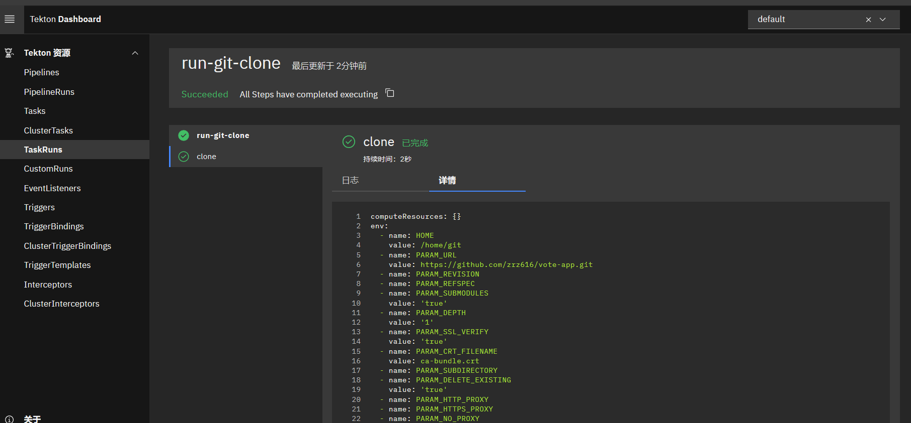
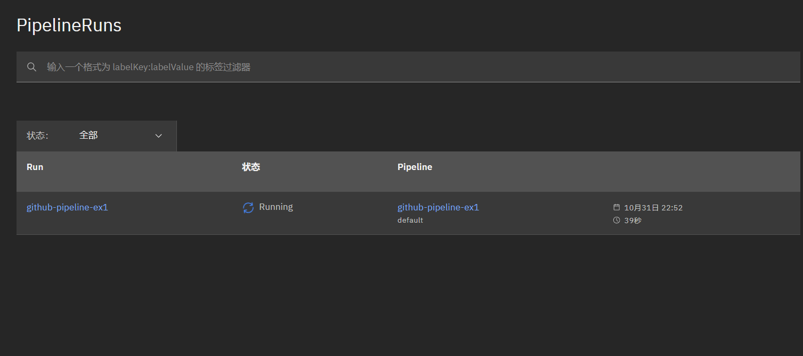
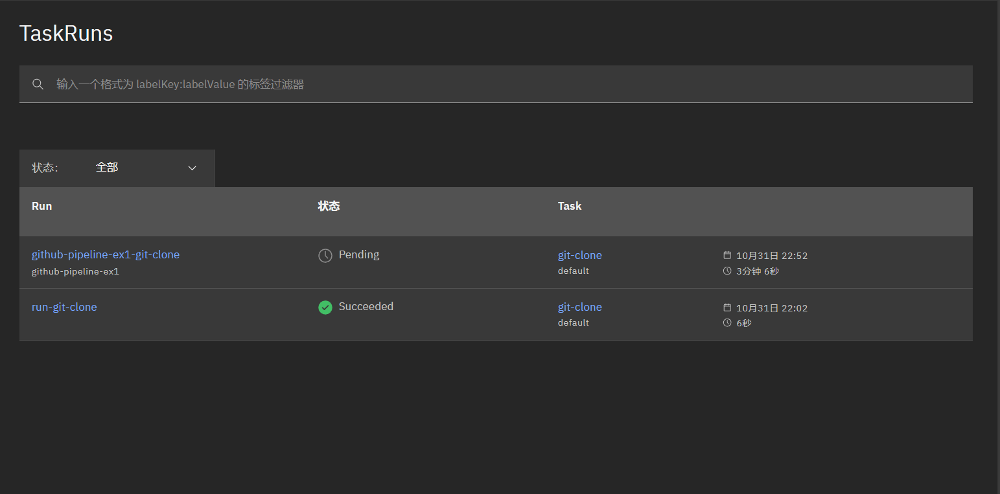
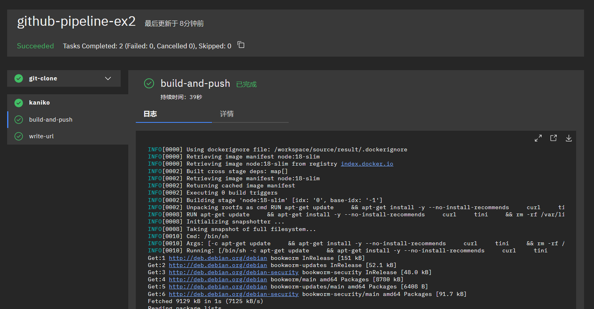
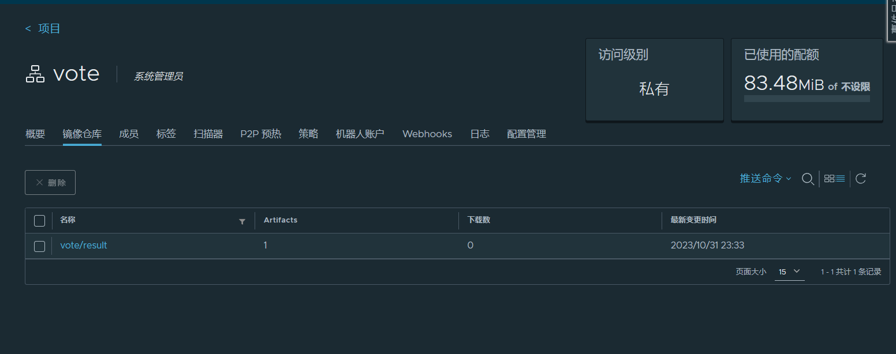
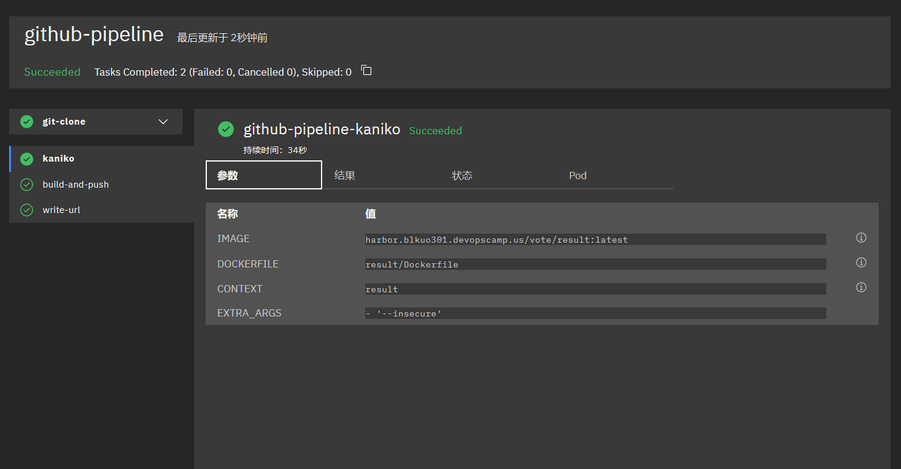
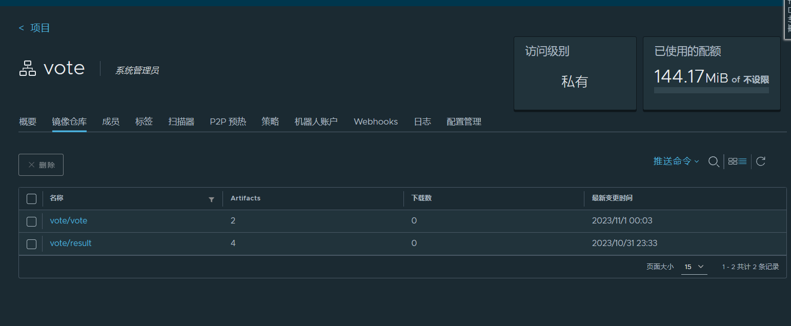

# tekton
tekton有几个核心概念`task`、`pipeline`、`workspace`、`Trigger`

## task
- 一个task是一段代码，用于完成特定的工作。Task 可以包含多个step
- tekton提供task CRD对象描述task，`taskRun` CRD对象用来执行task

例如: 
``` yaml
apiVersion: tekton.dev/v1
kind: TaskRun
metadata:
  name: run-git-clone
spec:
  # 在安装 jenkins 时已经提前部署了 serviceaccount
  serviceAccountName: build-bot
  taskRef:
    name: git-clone
  params:
    - name: url
      value: "https://github.com/zrz616/vote-app.git"
  workspaces:
    - emptyDir: {}
      name: output
```
- 其中taskRef指向的`git-clone`是由`hub.tekton.dev`提供的`task`, 参考：https://hub.tekton.dev/tekton/task/git-clone
- 在k8s集群中apply上述yaml，tekton将执行git clone的任务



## pipeline
- pipeline是一组tasks, 按顺序串联起来
- 每个task都会生成一个artifact(输出), 然后传给下一个task
- 所有task的output artifacts被收集到一个单一目录中

### workspaces
- 存放源文件和构建结果的地方
- 这个目录只能在pod内使用, pod之间不共享
- 需要在pipelineRun中配置workspaces


### example
``` yaml
apiVersion: tekton.dev/v1
kind: PipelineRun
metadata:
  name: github-pipeline-ex1
spec:
  taskRunSpecs:
    - pipelineTaskName: git-clone
      serviceAccountName: build-bot
  pipelineRef:
    name: github-pipeline-ex1
  params:
    - name: git_url
      value: "https://github.com/devops-advanced-camp/vote.git"
  workspaces:
    - name: output
      persistentVolumeClaim:
        claimName: pipeline-pvc
      subPath: $(context.pipelineRun.uid)
```

- 执行上面的PipelineRun，可以在dashboard上看到：



- 在TaskRun下也出现了对应的TaskRun



## ex2 推送镜像
- 通过workspaces传入harbor的凭据,已经提前设置好名为docker-credentials的secret
- Pipeline CRD中定义workspaces
- 通过PipelineRun将secret挂载到workspaces上

``` yaml
# pipeline
apiVersion: tekton.dev/v1beta1
kind: Pipeline
metadata:
  name: github-pipeline-ex2
spec:
  workspaces:
    - name: output
    - name: docker-credentials
  params:
    - name: git_url
  tasks:
    # task 1: git-clone
    - name: git-clone
      taskRef:
        name: git-clone
      workspaces:
        - name: output
          workspace: output
      params:
        - name: url
          # 指向 pipeline 定义的 git_url 参数
          value: $(params.git_url)
    # task 2: build image with kaniko
    - name: kaniko
      taskRef:
        name: kaniko
      runAfter:
        - git-clone
      workspaces:
        - name: source
          workspace: output
        - name: dockerconfig
          workspace: docker-credentials
      params:
        - name: IMAGE
          value: harbor.blkuo301.devopscamp.us/vote/result:latest
        - name: DOCKERFILE
          value: result/Dockerfile
        - name: CONTEXT
          value: result
        - name: EXTRA_ARGS
          value:
            - "--insecure"
---
# PipelineRun
apiVersion: tekton.dev/v1
kind: PipelineRun
metadata:
  name: github-pipeline-ex2
spec:
  taskRunSpecs:
    - pipelineTaskName: git-clone
      serviceAccountName: build-bot
  pipelineRef:
    name: github-pipeline-ex2
  params:
    - name: git_url
      value: "https://github.com/zrz616/vote-app.git"
  workspaces:
    - name: output
      persistentVolumeClaim:
        claimName: pipeline-pvc
      subPath: $(context.pipelineRun.uid)
    - name: docker-credentials
      secret:
        secretName: docker-credentials
```

- 可以看见任务进度



- 在harbor中也可以看见成功推送了



## ex3 大仓构建
还能进一步改造pipeline，提高复用性

``` yaml
# Pipeline
apiVersion: tekton.dev/v1beta1
kind: Pipeline
metadata:
  name: github-pipeline
spec:
  workspaces:
    - name: output
    - name: docker-credentials
  params:
    - name: git_url
    # git repository name
    - name: git_repository
      default: "vote"
    # microservice name(build path)
    - name: microservice
      default: "result"
    - name: registry_url
      default: ""
    # - name: sonar_host_url
    #   default: "http://sonarqube-sonarqube.sonarqube.svc.cluster.local:9000"
    - name: commit_id
      default: "latest"
  tasks:
    - name: git-clone
      taskRef:
        name: git-clone
      workspaces:
        - name: output
          workspace: output
      params:
        - name: url
          value: $(params.git_url)
    - name: kaniko
      taskRef:
        name: kaniko
      runAfter:
        - git-clone
      workspaces:
        - name: source
          workspace: output
        - name: dockerconfig
          workspace: docker-credentials
      params:
        - name: IMAGE
          value: $(params.registry_url)/$(params.git_repository)/$(params.microservice):$(params.commit_id)
        - name: DOCKERFILE
          value: $(params.microservice)/Dockerfile
        - name: CONTEXT
          value: $(params.microservice)
        - name: EXTRA_ARGS
          value:
            - "--insecure"
---
# PipelineRun
apiVersion: tekton.dev/v1
kind: PipelineRun
metadata:
  name: github-pipeline
spec:
  taskRunSpecs:
    - pipelineTaskName: git-clone
      serviceAccountName: build-bot
  pipelineRef:
    name: github-pipeline
  params:
    - name: git_url
      value: "https://github.com/zrz616/vote-app.git"
    - name: microservice
      value: "result"
    - name: git_repository
      value: "vote"
    - name: commit_id
      value: "latest"
    - name: registry_url
      value: "harbor.blkuo301.devopscamp.us"
  workspaces:
    # - name: output
    #   volumeClaimTemplate:
    #     spec:
    #       accessModes:
    #         - ReadWriteOnce
    #       resources:
    #         requests:
    #           storage: 20Mi
    - name: output
      persistentVolumeClaim:
        claimName: pipeline-pvc
      subPath: $(context.pipelineRun.uid)
    - name: docker-credentials
      secret:
        secretName: docker-credentials

```

- 通过`microservice`可以指定目录构建



只需要修改pipelineRun中的microservice参数就行了
``` yaml
apiVersion: tekton.dev/v1
kind: PipelineRun
metadata:
  name: github-pipeline
spec:
  taskRunSpecs:
    - pipelineTaskName: git-clone
      serviceAccountName: build-bot
  pipelineRef:
    name: github-pipeline
  params:
    - name: git_url
      value: "https://github.com/zrz616/vote-app.git"
    - name: microservice
      value: "vote"
    - name: git_repository
      value: "vote"
    - name: commit_id
      value: "latest"
    - name: registry_url
      value: "harbor.blkuo301.devopscamp.us"
  workspaces:
    # - name: output
    #   volumeClaimTemplate:
    #     spec:
    #       accessModes:
    #         - ReadWriteOnce
    #       resources:
    #         requests:
    #           storage: 20Mi
    - name: output
      persistentVolumeClaim:
        claimName: pipeline-pvc
      subPath: $(context.pipelineRun.uid)
    - name: docker-credentials
      secret:
        secretName: docker-credentials
```
- 可以看见vote仓库也被构建出来了

