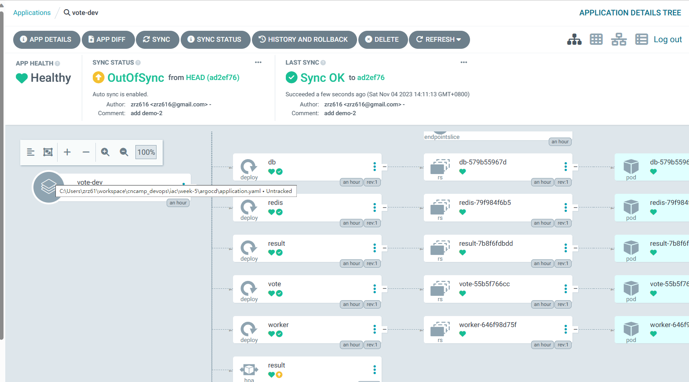
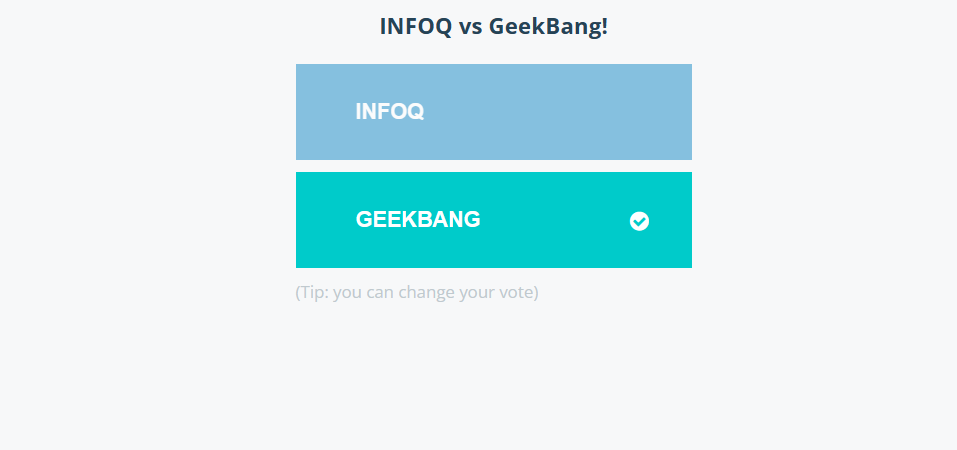

# 持续部署

## Argocd

### install
``` shell 
helm repo add argo https://argoproj.github.io/argo-helm
helm upgrade --install -n argocd argocd argo/argo-cd -f /tmp/argocd-values.yaml --create-namespace
```

### 简单示例
``` yaml
# https://argo-cd.readthedocs.io/en/stable/operator-manual/declarative-setup/#applications
apiVersion: argoproj.io/v1alpha1
kind: Application
metadata:
  name: vote-dev
  namespace: argocd
spec:
  project: default
  source:
    repoURL: https://github.com/zrz616/vote-helm.git
    targetRevision: HEAD
    path: demo-2
    helm:
      valueFiles:
        - values.yaml
  destination:
    server: https://kubernetes.default.svc
    namespace: vote-dev
  syncPolicy:
    automated:
      prune: true
      selfHeal: true
    syncOptions:
      - CreateNamespace=true
---
apiVersion: v1
kind: Secret
metadata:
  name: vote-helm-repo
  namespace: argocd
  labels:
    argocd.argoproj.io/secret-type: repository
stringData:
  url: https://github.com/zrz616/vote-helm.git
  password: "<personal_tekton>"
  username: zrz616
```
将Application CRD对象和github仓库的授权部署到集群后，argocd就会自动创建并apply到集群中，可以在argocd的Dashboard中查看创建过程



可以看到应用成功部署了
- 
- 

这中方式下需要通过手动修改镜像版本来触发更新
- 手动修改vote-helm仓库中的镜像版本
- 更新后argocd将自动更新应用